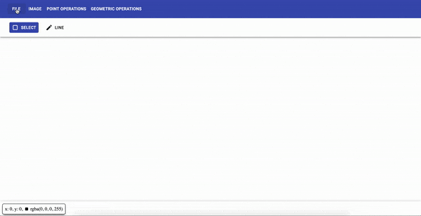

  

<h1 align="center">Web Image Processing</h1>

 Simple image processing in the browser 

 <a href="https://carlosdg.github.io/wip/">App</a> | <a href="https://wipblog463382623.wordpress.com/">Blog</a> | <a href="https://twitter.com/wip_open_source">Twitter</a> 

## Table of Contents

- [Introduction](#introduction)
- [How to use](#how-to-use)
- [Contributing](#contributing)
- [Authors](#authors)
- [License](#license)

## Introduction

WIP is an open source web application that allows the users to apply different image processing operations. 🌆 → 🏙

You can load & download images, apply different operations and it is meant so users can easily **visualize the changes** between images. 🌆🏙 🤔

Everything is done in the front-end so your images never leave your device 🖥🔐

## How to use

You can access the application at the following link: [https://carlosdg.github.io/wip/](https://carlosdg.github.io/wip/).

You can find the tool bar at the top of the app. To open an image from your device head to `File -> Open` and the browser will prompt you to select the image to open.

To apply some operation to an image you have to first select the image to apply the operation. For that you only need to click (or tap) on the image you wish to work with. You know which image is currently selected by the color of the image toolbar (the blue one is the selected).

You can drag the image items by dragging the top of the image. You can also resize the image item by dragging the little handle at the bottom right and if the image is still bigger than the item you can scroll the view to see portions of the image.

  

## Contributing

You can contribute with anything, from letting us know of some broken English with an issue to adding new features with pull requests (or even fixing some broken English with a pull request 🤯). Any help will be warmly welcome 😊.

Before submitting a pull request please file an issue, we may be working on the same topic and with an issue we can let you know so you don't waste your time 😄

- [Report a bug 🐞 at this link](https://github.com/carlosdg/wip/issues/new?assignees=&labels=bug&template=bug-report---.md&title=%5BBUG%5D+Issue+Title)
- [Request a feature 💡at this link](https://github.com/carlosdg/wip/issues/new?assignees=&labels=enhancement&template=feature-request---.md&title=%5BFeat%5D+Issue+Title)
- For any other topic or to ask a question you can [file a regular issue at this link](https://github.com/carlosdg/wip/issues/new)

Before any pull request, please check the [Contributing guidelines](./CONTRIBUTING.md) to know how to setup the project (install dependencies, run tests, etc)

## Authors

- Alberto Jesús González Álvarez &lt;[AlberTJ97](https://github.com/AlberTJ97)&gt;
- Daute Rodríguez Rodríguez &lt;[DauteRR](https://github.com/DauteRR)&gt;
- Carlos Domínguez García &lt;[carlosdg](https://github.com/carlosdg)&gt;

## License

MIT
